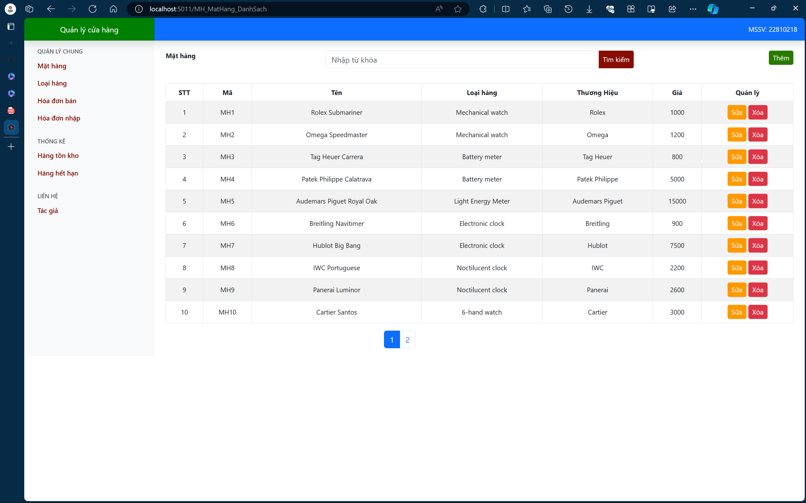

# Phần mềm Quản lý Cửa hàng

## Mục lục
1. [Giới thiệu](#giới-thiệu)
2. [Cấu trúc Dự án](#cấu-trúc-dự-án)
3. [Chức năng](#chức-năng)
4. [Hướng dẫn cài đặt và chạy](#hướng-dẫn-cài-đặt-và-chạy)
5. [Mô hình 3 lớp](#mô-hình-3-lớp)
6. [Minh họa giao diện](#minh-họa-giao-diện)
7. [Liên hệ](#liên-hệ)

## Giới thiệu

Phần mềm quản lý cửa hàng là một ứng dụng web viết bằng C# nhằm hỗ trợ quản lý các mặt hàng, loại hàng, hóa đơn nhập, hóa đơn xuất, thống kê hàng tồn kho và hàng hết hạn sử dụng. Ứng dụng được xây dựng theo mô hình 3 lớp và lưu trữ dữ liệu trên các tập tin.

## Cấu trúc Dự án

Dự án được tổ chức theo mô hình 3 lớp bao gồm:
1. **Presentation Layer (Lớp trình bày)**: Chịu trách nhiệm hiển thị giao diện người dùng và tương tác với người dùng.
2. **Business Logic Layer (Lớp xử lý nghiệp vụ)**: Chịu trách nhiệm xử lý các logic nghiệp vụ của ứng dụng.
3. **Data Access Layer (Lớp truy cập dữ liệu)**: Chịu trách nhiệm truy xuất và lưu trữ dữ liệu từ/tới các tập tin.

## Chức năng

1. **Quản lý Mặt hàng (Product)**:
   - Thêm mặt hàng
   - Xóa mặt hàng
   - Sửa mặt hàng
   - Tìm kiếm mặt hàng
   - Hiển thị danh sách mặt hàng

2. **Quản lý Loại hàng (Category)**:
   - Thêm loại hàng
   - Xóa loại hàng
   - Sửa loại hàng
   - Tìm kiếm loại hàng
   - Hiển thị danh sách loại hàng

3. **Quản lý Hóa đơn Nhập (Invoice)**:
   - Thêm hóa đơn nhập
   - Xóa hóa đơn nhập (xóa mềm)
   - Sửa hóa đơn nhập
   - Tìm kiếm hóa đơn nhập

4. **Quản lý Hóa đơn Xuất (Invoice)**:
   - Thêm hóa đơn xuất
   - Xóa hóa đơn xuất (xóa mềm)
   - Sửa hóa đơn xuất
   - Tìm kiếm hóa đơn xuất

5. **Kho hàng (Warehouse)**:
   - Thống kê hàng tồn kho
   - Thống kê hàng hết hạn sử dụng

## Hướng dẫn cài đặt và chạy

1. **Yêu cầu hệ thống**:
   - .NET Core SDK 3.1 trở lên
   - Trình duyệt web hiện đại (Chrome, Firefox, Edge)

2. **Cài đặt và chạy ứng dụng**:
   - Tải mã nguồn từ kho lưu trữ.
   - Mở dự án bằng Visual Studio.
   - Khởi động ứng dụng bằng cách nhấn F5 hoặc chọn "Start Debugging".

## Mô hình 3 lớp

1. **Presentation Layer**:
   - Chứa các trang web và giao diện người dùng.
   - Kết nối với Business Logic Layer để xử lý các yêu cầu từ người dùng.

2. **Business Logic Layer**:
   - Chứa các logic nghiệp vụ, xử lý dữ liệu và điều kiện nghiệp vụ.
   - Giao tiếp với Data Access Layer để lấy và lưu dữ liệu.

3. **Data Access Layer**:
   - Chứa các lớp và phương thức để đọc/ghi dữ liệu từ/tới các tập tin.
   - Sử dụng kỹ thuật serialization để lưu trữ dữ liệu.

## Minh họa giao diện

Dưới đây là một hình minh họa giao diện của ứng dụng.

## Liên hệ

Nếu bạn có bất kỳ câu hỏi hoặc vấn đề gì, xin vui lòng liên hệ:
- Tên: Nguyễn Văn A
- Email: nguyenvana@example.com
- Số điện thoại: 0123456789

---

Cảm ơn bạn đã sử dụng phần mềm Quản lý Cửa hàng của chúng tôi. Hy vọng ứng dụng sẽ giúp bạn quản lý công việc hiệu quả hơn!
